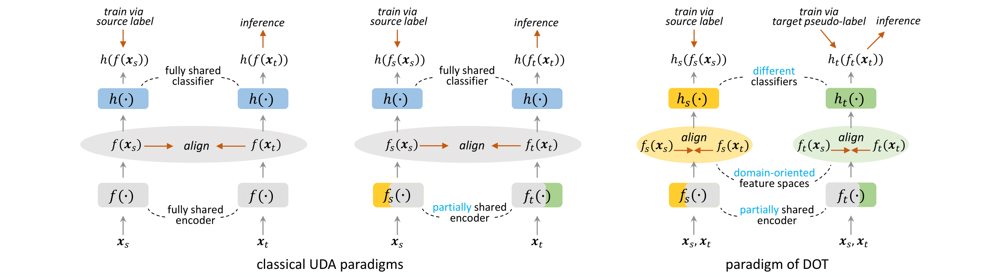

---

<div align="center">    

# Making the Best of Both Worlds: A Domain-Oriented Transformer for Unsupervised Domain Adaptation

Wenxuan Ma, Jinming Zhang, [Shuang Li](https://shuangli.xyz), , [Chi Harold Liu](https://scholar.google.com/citations?user=3IgFTEkAAAAJ&hl=en), [Yulin Wang](https://www.rainforest-wang.cool/), and Wei Li

[](https://arxiv.org/abs/2208.01195)

</div>

Official implementation of our ACM MM 2022 paper "Making the Best of Both Worlds: A Domain-Oriented Transformer for Unsupervised Domain Adaptation" (DOT). 

## Framework Overview

In this work, we propose a new UDA paradigm that simultaneously learns multiple feature embedding spaces with their own different specification (denoted as **domain-oriented feature spaces**). The comparison between our new paradigm and the classical ones is shown in the figure.



## Datasets Preparation
### Office-Home
Office-home dataset can be download from [here](https://www.hemanthdv.org/officeHomeDataset.html).

### VisDA-2017
VisDA-2017 dataset can be download from [here](http://ai.bu.edu/visda-2017/).

### DomainNet
DomainNet dataset can be download from [here](http://ai.bu.edu/M3SDA/).

When finish downloading, please modify the corresponding data lists in "./data/" to match your data root.

## Training DOT for Unsupervised Domain Adaptation

### Source Model

First, download the ImageNet-1k pretrained [vit_small](https://dl.fbaipublicfiles.com/deit/deit_small_distilled_patch16_224-649709d9.pth) and [vit_base](https://dl.fbaipublicfiles.com/deit/deit_base_distilled_patch16_224-df68dfff.pth) model, and put them under the "./pretrained/" directory.

Next, a source model is trained to generate initial pseudo-labels for DOT training. The source model can be downloaded [here](https://github.com/BIT-DA/Domain-Oriented-Transformer/releases).

Or you can run the following command to train the source model by yourself: 
```python
# Office-Home [0,1,2,3]->[Ar,Cl,Pr,Rw]
python train_sourceonly.py --dset home --s 0 --model vit_small --output_src [YOUR_SOURCE_MODEL_ROOT]  --mixup-active --save --seed 2022 --gpu_id 0 

# VisDA2017 [0,1]->[Synthetic,Real]
python train_sourceonly.py --dset home --s 0 --model vit_small --output_src [YOUR_SOURCE_MODEL_ROOT] --mixup-active --save --seed 2022 --gpu_id 0 
```

### Training DOT

Run the following command to train a DOT model.

```python
# Office-Home [0,1,2,3]->[Ar,Cl,Pr,Rw]
python train_DOT.py --dset home --s 0 --t 1 --model dot_small --output_dir output  --src_model_path [YOUR_SOURCE_MODEL_ROOT] --seed 2022 --gpu_id 0

# VisDA2017 [0,1]->[Synthetic,Real]
python train_DOT.py --dset visda2017 --s 0 --t 1 --model dot_small --output_dir output  --src_model_path [YOUR_SOURCE_MODEL_ROOT] iter_per_epoch 1000 --lr 1e-3 --seed 2022 --gpu_id 0
```

## Acknowledgement
This repository borrows codes from the following repos. Many thanks to the authors for their great work.

timm-library: https://github.com/rwightman/pytorch-image-models

SHOT: https://github.com/tim-learn/SHOT

SupContrast: https://github.com/HobbitLong/SupContrast

## Citation
If you find this project useful, please consider citing:

```
@inproceedings{ma2022making,
  title={Making the Best of Both Worlds: A Domain-Oriented Transformer for Unsupervised Domain Adaptation},
  author={Ma, Wenxuan and Zhang, Jinming and Li, Shuang and Liu, Chi Harold and Wang, Yulin and Li, Wei},
  booktitle={Proceedings of the 30th ACM International Conference on Multimedia},
  pages={5620--5629},
  year={2022}
}
```

## Contact

If you have any questions about our code, feel free to contact us or describe your problem in [Issues](https://github.com/BIT-DA/SePiCo/issues/new).

Email address: wenxuanma@bit.edu.cn; jinming-zhang@bit.edu.cn.

<div align="right">
<b><a href="#overview">↥</a></b>
</div>